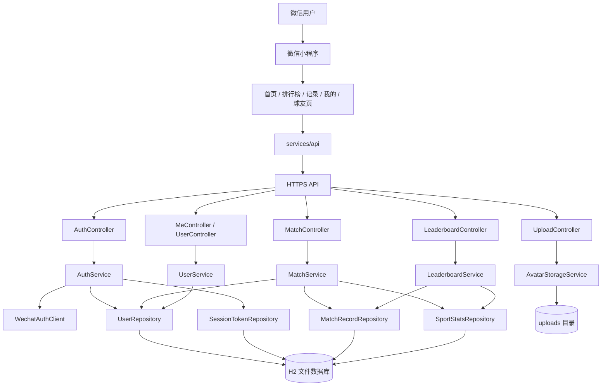
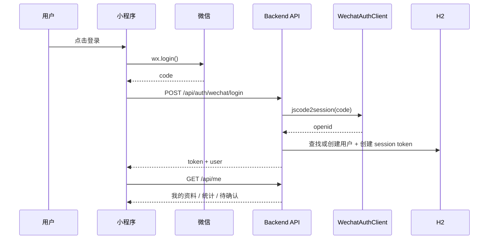
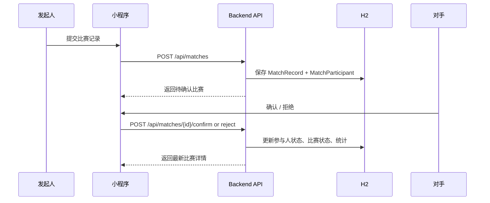

# 你挺有球呗

一个给熟人球局使用的微信小程序，围绕“记录比赛、对手确认、生效统计、月榜查看”来组织体验。当前支持台球、羽毛球、乒乓球三类项目，前后端分离，后端提供比赛、登录、排行榜和个人数据接口，前端使用原生微信小程序承接完整流程。

## 功能概览

- 微信登录与会话管理
- 首页公开浏览最新已确认球局
- 按球类查看自然月月榜
- 发起比赛记录、对手确认、拒绝、取消
- 我的战绩、球友详情、最近比赛
- 头像上传与个人资料初始化

## 技术栈

### Backend

- Java 17
- Spring Boot 3
- Spring Web / Spring Data JPA
- H2 文件数据库
- Maven

### Frontend

- 原生微信小程序
- TypeScript + 运行时 `.js`
- 自定义 TabBar
- Node.js 内置测试运行器

## 项目结构

```text
.
├── backend
│   ├── src/main/java/com/ntyqb/backend
│   │   ├── config
│   │   ├── controller
│   │   ├── dto
│   │   ├── entity
│   │   ├── exception
│   │   ├── repository
│   │   └── service
│   └── src/test/java/com/ntyqb/backend
├── frontend
│   ├── miniprogram
│   │   ├── components
│   │   ├── custom-tab-bar
│   │   ├── pages
│   │   ├── services
│   │   ├── types
│   │   └── utils
│   └── tests
└── docs
```

## 架构图



## 核心数据流

### 1. 登录链路



### 2. 比赛记录链路



## 核心模块

### 后端

- `controller`
  - 对外暴露 REST API，覆盖登录、比赛、排行榜、我的资料、球友资料、头像上传。
- `service`
  - 承载业务规则。
  - `AuthService` 负责登录、会话、当前用户解析。
  - `MatchService` 负责比赛创建、确认、取消、查询。
  - `LeaderboardService` 负责自然月月榜聚合。
  - `AvatarStorageService` 负责头像落盘与访问路径生成。
  - `WechatAuthClient` 负责调用微信 `jscode2session`。
- `repository`
  - JPA 数据访问层，围绕用户、会话、比赛、统计四类核心数据。
- `entity`
  - 抽象比赛、参赛人、用户、会话、统计等领域对象。

### 前端

- `pages/home`
  - 首屏入口，支持游客浏览公开球局。
- `pages/leaderboard`
  - 自然月月榜，支持游客浏览。
- `pages/records`
  - 登录后发起和管理比赛记录。
- `pages/profile`
  - 登录后查看个人资料、统计和战绩。
- `pages/player`
  - 查看球友详情和对应球类战绩。
- `pages/auth`
  - 用户主动触发时进入的授权登录页。
- `services/api`
  - 统一封装 token、请求、鉴权失败处理、登录回跳。
- `utils`
  - 处理登录回跳、页面刷新状态、头像链接、分享配置等页面基础能力。

## 当前业务规则

- 首页和排行榜支持未登录浏览。
- 记录页、我的页、球友详情页需要登录后使用。
- 排行榜为自然月口径，不是累计总榜。
- 比赛只有在确认生效后才会进入统计和月榜。
- 小程序分享已开启，首页、月榜、记录页、我的页、球友页都支持分享。

## 本地开发

### 1. 启动后端

```bash
cd backend
mvn spring-boot:run
```

默认地址：

- API: `http://127.0.0.1:8080/api`
- Health: `http://127.0.0.1:8080/api/health`
- H2 Console: `http://127.0.0.1:8080/h2-console`

### 2. 启动小程序

1. 用微信开发者工具打开 `frontend`
2. 编译运行小程序
3. 当前默认请求地址配置在 `frontend/miniprogram/app.ts`

说明：

- 当前仓库中的小程序默认 API 地址指向线上域名 `https://niyoushashilia.cloud/api`
- 如果需要本地联调，请把 `frontend/miniprogram/app.ts` 和 `frontend/miniprogram/services/api.ts` 中的默认地址切回本地服务

## 测试

### 后端测试

```bash
cd backend
mvn -Dmaven.repo.local=/Users/zhangliyuan/codexprojects/ntyqb/.m2 test
```

### 前端测试

```bash
cd frontend
npm test
```

## 补充说明

- 后端当前使用 H2 文件数据库，适合轻量开发和单机部署。
- 数据种子、用户标签、认证模式等配置都放在 `backend/src/main/resources/application.yml`。
- 微信登录依赖小程序 `appid` 和 `app secret`，线上需要在后端配置中提供。
